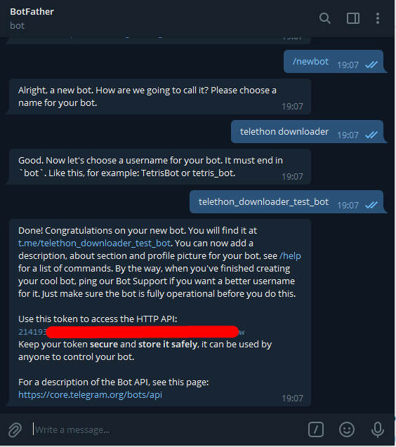

# telethon-downloader

telethon-downloader es un proyecto en docker que permite usar un bot de telegram para descargar archivos de hasta 2000mb, solo enviando el archivo a descargar al bot y este se encargará de descargarlo en el servidor por ti.

\
telethon-downloader es un proyecto Fork de "rodriguezst", el cual está abandonado hace mas de 2 años y que dockerizamos principalmente para su uso de Unraid, pero que actualmente puede ser usando en distintas plataformas.

Las ultimas mejoras incluyen:

* Descarga en carpetas por tipos de archivos
* Descarga de imagenes con y sin compresión
* Descarga de archivos .torrent (para enviarlos a la carpeta watch de su cliente torrent)
* descarga en carpeta por nombres de archivos (ejemplo en el config.ini de la carpeta /config)

github: [https://github.com/jsavargas/telethon\_downloader](https://github.com/jsavargas/telethon\_downloader)

dockerhub: [https://hub.docker.com/r/jsavargas/telethon\_downloader](https://hub.docker.com/r/jsavargas/telethon\_downloader)

.png>)


## docker-compose.yml

```
version: '3'
 
services:
 
  telethon_downloader:
    image: jsavargas/telethon_downloader
    container_name: telethon_downloader
    restart: unless-stopped
    network_mode: host
    environment:
      - 'PUID=1000'
      - 'PGID=1000'
      - 'TG_AUTHORIZED_USER_ID='  #<telegram chat_id authorized>
      - 'TG_API_ID='
      - 'TG_API_HASH=' 
      - 'TG_BOT_TOKEN='
      - 'TG_PROGRESS_DOWNLOAD=True' #OPTIONAL
      - 'TZ=America/Santiago'
    volumes:
      - /path/to/config:/config
      - /path/to/download:/download
      - /path/to/download/torrent/watch:/watch
```

## **Variables obligatorias**

* **TG\_API\_ID**&#x20;
* **TG\_API\_HASH**&#x20;
* **TG\_BOT\_TOKEN**&#x20;
* **TG\_AUTHORIZED\_USER\_ID**&#x20;

### Como obtener **TG\_API\_ID** / **TG\_API\_HASH**&#x20;

Para obtener estos valores, deberemos entrar en esta web [https://my.telegram.org/auth](https://my.telegram.org/auth) y generar la api

#### Paso a paso

Entra**re**mos en [https://my.telegram.org/auth](https://my.telegram.org/auth)

.png>)

Confirmamos con la clave que nos enviarán por mensaje a Telegram

.png>)

Luego iremos a la sección de API

.png>)

Deberemos rellenar los campos que son requeridos y pinchar en «create application»

.png>)

Y se nos presenta los dos valores que nos interesan. Api\_id y Api\_hash.

.png>)

### _IMPORTANTE!!!!!!!!!_

_Estos valores no debemos difundirlos… son únicos y NO podemos cambiarlos. Es decir no hay revocación posible como ocurre con el token. Estos valores deberemos anotarlos ya que tendremos que utilizarlos en las variables de entorno_

* TG\_API\_ID
* TG\_API\_HASH

_NO APRETAR ACA!! ya que no se elimina la app creada, se elimina la cuenta de Telegra_

.png>)

### Como obtener **TG\_BOT\_TOKEN**&#x20;

El primer paso para crear tu bot es hacer que Telegram sepa que existe. Para ello en el buscador de Telegram busca: [BotFather](https://t.me/BotFather). Abre el resultado llamado _@BotFather_ y que tiene una marca de verificación azul.

.png>)

Interactuar con BotFather consiste en intercambiar mensajes. Dale a “Start” y te aparecerán una serie de comandos. Cada uno te servirá para personalizar tu bot al máximo.

Vamos a crear el bot ejecutando el comando `/newbot` o dando clic a dicho comando. Te va a preguntar el nombre del bot y luego el username. En mi caso le llamaré **telethon downloader**. Para colocar el username es importante que el nombre termine en “bot” y no puede iniciar con un número. Yo le llamaré **telethon\_downloader\_test\_bot**.



Con eso tu bot ya está creado. Ahora te va a dar un mensaje con recomendaciones, la URL del bot y tu token de acceso. **No compartas con nadie este token** porque cualquiera que lo tenga podría utilizar tu bot.

### Como obtener **TG\_AUTHORIZED\_USER\_ID**

En esta variable, deberas ingresar tu **ID** de usuario de telegram, para que solo tu puedas enviarle archivos y/o interactuar con el.

También puedes agregar el id de otro usuario separado por comas ejemplo id1,id2,id3,.....

También puedes agregar el id de un grupo. Se recomienda que primero ingreses tú id, luego otros usuarios o grupos si es que lo deseas

Hay varias maneras de obtener tu id de telegram, para esta, usaremos **IDBot**&#x20;

.png>)

A este bot le escribiremos /getid y nos devolvera un numero, este es nuestro id de telegram

.png>)

Con esto ya tenemos las 4 variables para poder usar **telethon downloader**

## Configuracion de Volumenes

```
volumes:
  - /path/to/config:/config
  - /path/to/download:/download
  - /path/to/download/torrent/watch:/watch
```

* /**config**: Ruta donde irán los archivos de configuracion
* /**download**: Ruta  descarga  de los archivos
* /**watch**: Ruta donde el gestor de torrent recive los archivos torrent para descargarlos

.png>)

## Rutas y como descargar archivos por tipo de archivos

CABE MENCIONAR QUE PARA CREAR NUEVAS RUTAS, SE DEBEN AGREGAR NUEVOS VOLUMENES  AL DOCKER, APUNTANDO A ESAS NUEVAS RUTAS

EJEMPLO\
/mnt/user/media/media/series/:/series

En /config tenemos el archivo "config.ini" donde podremos agregar rutas especiales por extension de archivos.&#x20;

Ejemplo: si queremos que los archivos mp3 se descargen en otra ruta, aca se lo podemos indicar

.png>)

En este ejemplo

* Los archivos epub se descargarán en  /download/epub&#x20;
* Los archivos pdf se descargarán en /download/pdf&#x20;
* Los archivos cbr se descargarán en /download/pdf&#x20;
* Y los archivos mp3 se descargarán en /download/mp3&#x20;

Tambien podemos descargar en rutas dependiendo del nombre de archivo usando expresiones regulares

Ejemplo: si queremos que el archivo "Mi serie favorita S01E01.mkv se descarge en la carpeta series /series/Mi Serie Favorita (2022)/" podemos crear una regla para que todos los archivos que contengan "Mi Serie Favorita" se descargen directamente en esa ruta.

.png>)

En mi ejemplo, los archivos que dicen "#PobreNovio \_ Capítulo 98 \_ Mega.mp4" se descargan directamente en "/series/Poor Boyfriend (2021)/Season 01"

.png>)


